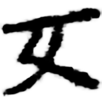
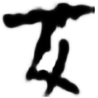
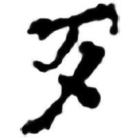

+++
radical = "78"
weight = 1
+++

#### 歹¹

Shortening of  used in compound glyphs as a semantic *DIE*.

#### 歹²

| S.Song | Yuan | Yuan | Qing |
| ----- | ----- | ----- | ----- |
|  |  |  |  |
| 成吉思汗手詔累朝崇道碑 | 紫微宮聖旨碑 | 御香代祀碑 | 內本康熙 |

{歹} *꜂taj* "bad"

Likely a graphical borrowing of a Khitan Small Script character.

- 鄒虎 2026 - 「歹」字溯源
